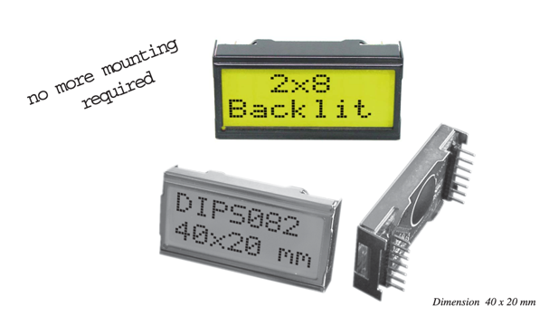

# AVS embedded systems course repository

## HW 1 - LED on/off

- Toggle LED through while loop (ORANGE LED)
- Toggle through internal timer (GREEN LED)
- Toggle through the wakeup button (RED LED)
- Toggle through joystick (BLUE LED)

## HW 2 - UART communication with keyboard / terminal / keypad

# HW 3 - LCD

## Assignment
Create a simple application for ARM CPU, which controls a seven-segment display and count-down counter with a second
delay.
After the application starts, display number 99 a then count-down to 0 with 1 second between each number.

Familiarize with the control principle of the EADIPS082 type alphanumeric LDC based on the use of the HD44780 LDC
controller.
Create a simple library for this LCD. Create a simple application for an ARM CPU
demonstrating the application of the library.

## Approach

---

## AVS kit ()

---

## SIPO (serial-in parallel output) register 74HC595

---

## HD44780 LCD controller — EADIPS082 type alphanumeric LDC

### Pinout
| Pin | Symbol     | Level | Function                      | Pin | Symbol      | Level | Function               |
|-----|------------|-------|-------------------------------|-----|-------------|-------|------------------------|
| 1   | VSS        | L     | Power Supply 0V (GND)         | 8   | D1          | H/L   | Display Data           |
| 2   | VDD        | H     | Power Supply +5V              | 9   | D2          | H/L   | Display Data           |
| 3   | VEE        | -     | Contrast (about 0.3V / 1.2V)  | 10  | D3          | H/L   | Display Data           |
| 4   | RS         | H/L   | H=Data / L=Command            | 11  | D4 (D0)     | H/L   | Display Data           |
| 5   | R/W        | H/L   | H=Read / L=Write              | 12  | D5 (D1)     | H/L   | Display Data           |
| 6   | E          | H     | Enable (falling edge)         | 13  | D6 (D2)     | H/L   | Display Data           |
| 7   | D0         | H/L   | Display Data / Anode LED-B/L  | 14  | D7 (D3)     | H/L   | Display Data, MSB      |

### Commands

### Character set

### Initialization

---

## HW 4 - AD/DA converter

- 16bit — can be adjusted
- data alignment - right/left (16bit can be degraded to 14b/12b)

https://moodle.fel.cvut.cz/mod/page/view.php?id=299735

ADC01
- potentiometer na AD
- AD converter — channel for measuring
- AD converter — channel for measuring from DAC
- can be connected through jumper

A/D converter,  input ADC0 (channel 9) - PB1 pin
A/D converter,  input ADC1 (channel 8) - PB0 pin
D/A converter, output DAC0 (channel 0) - PA4 pin 

## HW 5 - Accelerometer

nt35510 LCD driver pro revizi A09